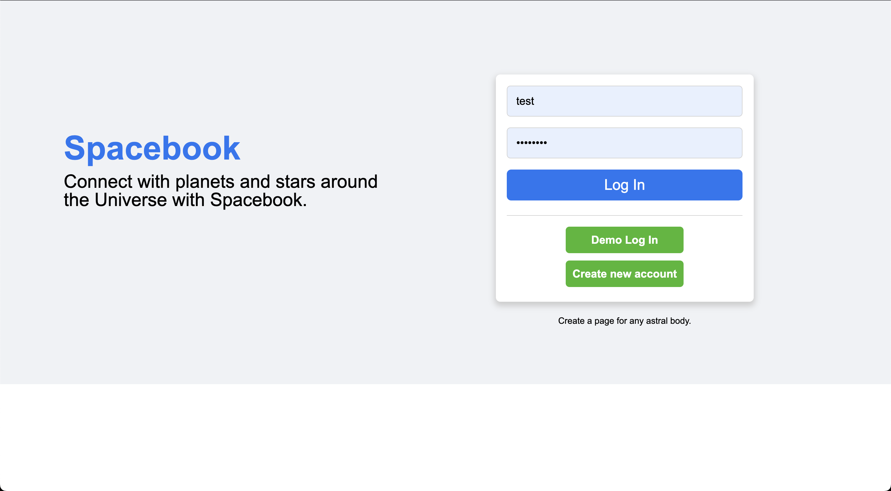
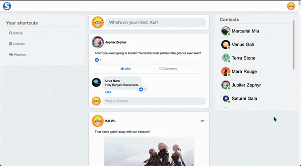
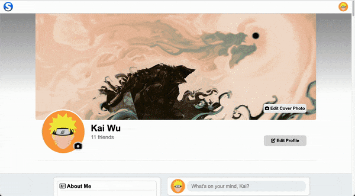
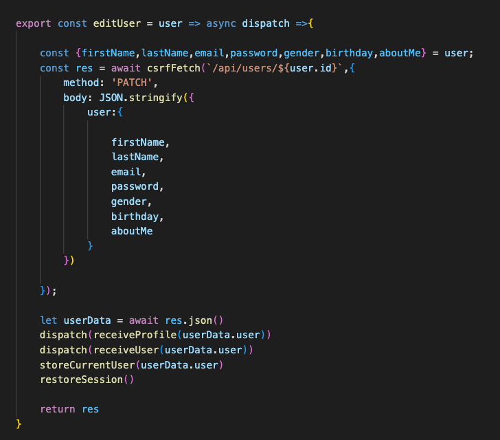

# Spacebook

## <b>[Try it here!](https://spacebook-98ir.onrender.com)<b>
## Login Page
   #  
## Home Page
   # 
## Profile Page
   # 

## <u>Background</u>

Spacebook is a fullstack clone of Meta's social media website Facebook. The goal of this project was to successfully clone basic backend and frontend capabilities of the original site. 

In the current implementation of Spacebook, a user is able given several features such as: account creation, demo login, login, and CRUD functionality for account information, posts, comments, friends, and likes. Users are also able to upload and delete photos for account profile pictures, cover photos, and post photos. All changes will persist across any account logged in. Data stored in the site currently was created using a seed file. 

## <u>Libraries and Methods</u>
The backend of this project was accomplished using Ruby on Rails while the frontend was accomplished using React, React Redux, and ReactRouter version 5; projects dependencies were handled using npm. The live version of this webproject is hosted on [Render](https://render.com/).Furthermore, [AWS S3](https://aws.amazon.com/s3/) was used to store images used in this project. 

## <u>Implementation</u>

Using rails with jbuilder, normaled backend data is formed as JSON responses which are sent over to the react frontend. Redux was used as data store, with slices of state made for several attributes such as users,posts,comments,likes,and friends. The data is then used in components created in react, with frontend routes made for different pages such as the home page and profile page. Styling was done with CSS and was done to match the style of the original site. 

## <u>Features</u>

Spacebook matches the basic uses of Facebook. Users are able to post posts, make comments, and edit their profiles. Logged in users are able to edit and delete the following: profile photo, cover photo, comments, and posts that belong to them. Logged in users can also add and remove other users as friends.  Thunk action creators (thunk is a middleware provided in react redux) were used to fetch data from the backend and parse it to a response in the components. Below is an example of a thunk action creator used to edit a user's information 

<!-- #  -->
```export const editUser = user => async dispatch =>{
    
    const {firstName,lastName,email,password,gender,birthday,aboutMe} = user;
    const res = await csrfFetch(`/api/users/${user.id}`,{
        method: 'PATCH',
        body: JSON.stringify({
            user:{
            
                firstName,
                lastName,
                email,
                password,
                gender,
                birthday,
                aboutMe
            }
        })
        
    });

    let userData = await res.json()
    dispatch(receiveProfile(userData.user))
    dispatch(receiveUser(userData.user))
    storeCurrentUser(userData.user)
    restoreSession()
    
    return res
}
```

## <u>Timeline</u>

* 3/31/2023 to 4/3/2023 
    * Creating and finishing User Auth features
* 4/3/2023 to 4/5/2023 
    * Creating profiles for users and using AWS database. 
* 4/5/2023 to 4/7/2023 
    * Creating implementaiton for user posts and friends.
* 4/8/2023 to 4/10/2023 
    * Creating implementation for user comments. 
* 4/11/2023 to 4/13/2023 
    * Creating user likes and other bonus features. 


## Future Implementation 
* Add hovering effects to display more information on components such as likes, comments and posts. 

* For friending, send a request to give users chance to accept/refuse a friend request. 

* Live chat using websockets. 
* Allow resizing of profile and cover photos. 
* Add favoriting and other reactions. 
* Allow users to follow/unfollow other users to control what shows on the splash page. 